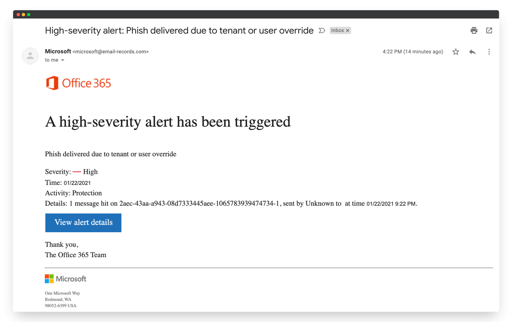

# Phishing Email Analysis – Cyber Security Internship Task 2

 # Objective: 
   Identify phishing characteristics in a suspicious email sample.

## Overview
This repository contains the analysis of a phishing email sample. The email pretends to be a Microsoft Office 365 security alert to lure the victim into clicking a malicious link.

## Email Sample

## Phishing Indicators Found
1. **Spoofed sender address** – `microsoft@email-records.com` instead of official `@microsoft.com`.
2. **Urgent language** – High-severity alert to create panic.
3. **Suspicious link** – "View alert details" button likely leads to phishing site.
4. **Generic greeting** – No personalization.
5. **Branding abuse** – Microsoft & Office 365 logos misused.
6. **Timing errors** – Time mismatch in message.
7. **Unnecessary technical details** – Random ID to look authentic.

## Conclusion
This is a clear phishing attempt designed to steal user credentials by exploiting fear and urgency. Always verify:
- Sender's email domain
- URLs before clicking
- Email headers
- Whether the message contains personalization

## Tools Suggested
- [MxToolbox Email Header Analyzer](https://mxtoolbox.com/EmailHeaders.aspx)
- [Whois Lookup](https://whois.domaintools.com/)
- [PhishTank](https://phishtank.com/)

## Interview Questions & Answers

1. What is phishing?

   Ans. -> Phishing is a cyber-attack where attackers trick people into revealing sensitive information (like passwords or credit card details) by pretending to be a trusted entity through email, messages, or fake websites.

2. How to identify a phishing email?

   Ans. -> Check sender’s domain for spoofing.
           Hover over links to see actual URL.
           Look for urgent or threatening language.
           Spot spelling/grammar mistakes.
           Notice lack of personalization.
           Suspicious attachments or links.

3. What is email spoofing?
   
   Ans. -> Email spoofing is forging the “From” address in an email to make it appear as if it’s from someone you trust, even though it comes from a malicious source.

4. Why are phishing emails dangerous?
They can:

   Ans. -> Steal login credentials or financial data
           Install malware on your system
           Compromise accounts for further attacks
           Lead to identity theft or financial loss

5. How can you verify the sender’s authenticity?

   Ans. -> Check the exact email domain
           View and analyze email headers
           Contact the sender via a known, official channel
           Use SPF, DKIM, and DMARC validation results

6. What tools can analyze email headers?

   Ans. -> MxToolbox Email Header Analyzer
           Google Admin Toolbox
           Microsoft Remote Connectivity Analyzer

7. What actions should be taken on suspected phishing emails?

   Ans. -> Don’t click any links or download attachments
           Report to your IT/security team
           Mark as spam or phishing in your email client
           Delete the email after reporting

8. How do attackers use social engineering in phishing?

   Ans. -> They exploit human emotions like urgency, fear, trust, or curiosity to manipulate the victim into taking unsafe actions, such as clicking a malicious               link or providing personal information.
